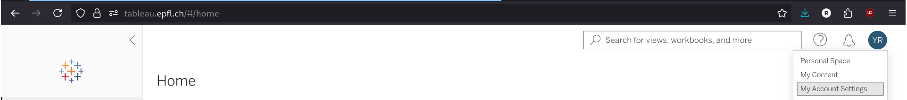
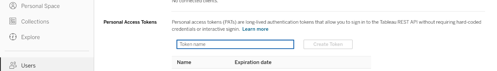
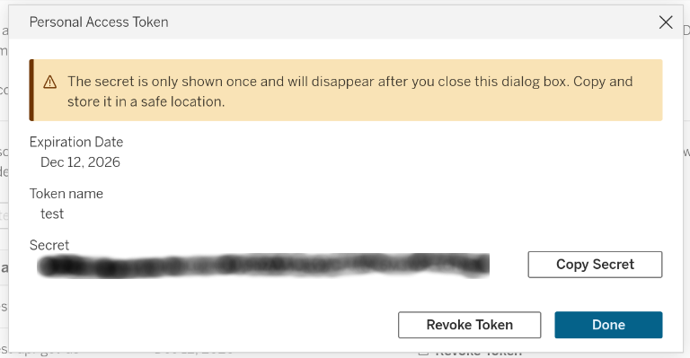

How to create a Personal Access Token
-----------------------------

1. Got to [https://tableau.epfl.ch](https://tableau.epfl.ch)
2. Open your account settings by clicking on your initials on the top right: 

3. Scroll down to the "Personal Access Tokens" section:

4. Enter the name for the new token.
5. Click on the "Create Token"button.
6. Copy the secret and the token name.
